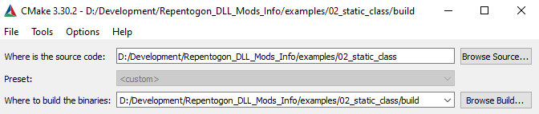
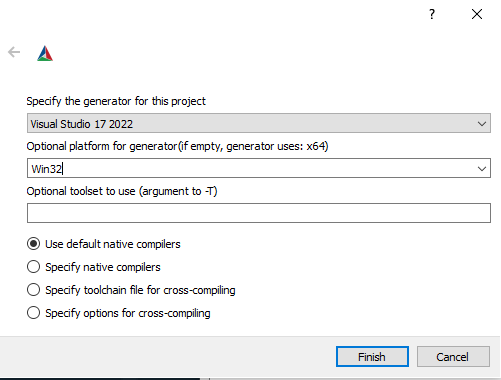
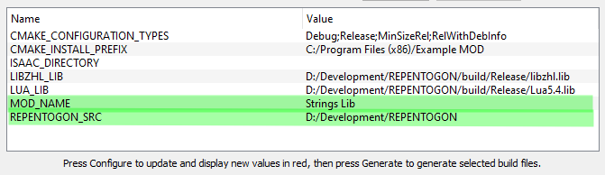

# REPENTOGON DLL Mods

The purpose of this repo is to document how to create DLL-based mods for [REPENTOGON](https://repentogon.com/), a script extender mod for [The Binding of Isaac: Repentance](https://store.steampowered.com/app/1426300/The_Binding_of_Isaac_Repentance/).

While you can continue to create Lua-based mods for The Binding of Isaac, REPENTOGON also allows you to create DLL-based mods that can provide additional functionality and optimizations.

This repo will provide various examples, showcasing different things you can do with DLL mods.

## Prerequisites
To ensure that the build scripts work properly, you will need to have a local development environment set up for REPENTOGON and have completed a successful build. You can follow the [REPENTOGON build steps](https://github.com/TeamREPENTOGON/REPENTOGON?tab=readme-ov-file#building).

## Building the Mods
Once you have your environment set up, each of the mods in this repo will follow a similar build process. Each mod has its own README in the directory and will note if there is any deviation from the standard build process mentioned here.

Just like the REPENTOGON build process, these mods will utilize CMake 3.1.3+.

1. Launch CMake.
2. Under "Where is the source code?", navigate to the root directory of the mod you want to compile.
3. Under "Where to put the binaries?", choose a build directory destination.

4. At the bottom of the CMake GUI, click "Configure".
   * If this is the first build, you will be prompted for more information.
   * The compiler must match your Visual Studio version.
   * The platform must be set to "Win32".
   * Leave all other options as default, and click Finish.

5. There are configuration entries that will need your attention prior to continuing.
   * **REPENTOGON_SRC**: This needs to be set to the root path where your REPENTOGON directory is located. The mods will **NOT** be able to compile without setting this variable.
   * **MOD_NAME**: This should be the name of your mod.
   * **ISAAC_DIRECTORY**: (optional) If set, the generated mod DLL will be copied to this directory. This should be set to the directory where `isaac-ng.exe` is located.

6. Once configuration is complete, click "Generate". This will create a .sln file in the build directory.
7. Once generation is complete, click "Open Project" to open the project in Visual Studio.
8. Build the project in Visual Studio.
9. If you did not set **ISAAC_DIRECTORY** in the configuration process, you will find the built DLL file in the build directory, either under Debug or Release, depending on which build option you selected. You can copy that file into your Isaac folder and start The Binding of Isaac with REPENTOGON. Please see the individual mod instructions for further details on testing the mod.

## Mods
1. [Basic Scaffolding Mod](01_mod_scaffolding): Basic scaffolding of a DLL mod, that will set a variable in Lua
   that can be checked for.
2. [Lua Function Mod](02_lua_function): This mod adds a global HelloWorld() function in Lua the prints to the console.
